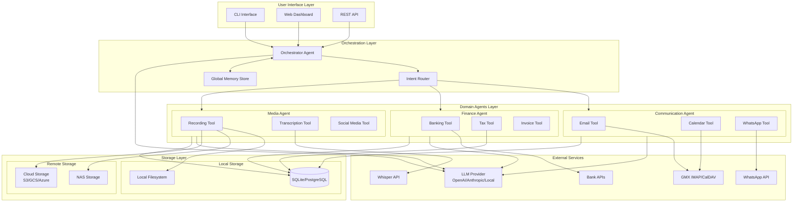
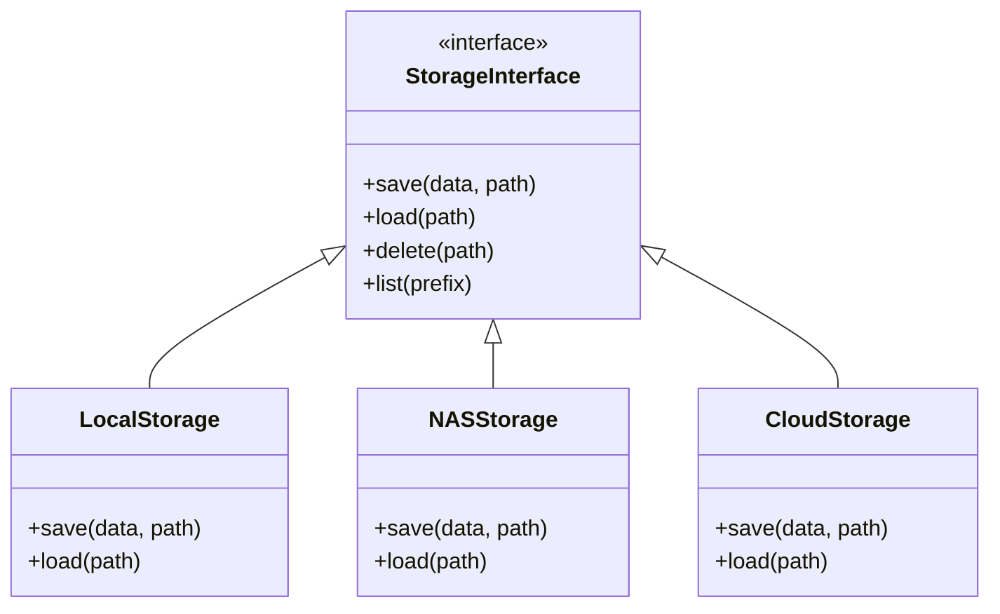

# Personal Agent Architecture

## Executive Summary

This document outlines the recommended architecture for a scalable personal agent system that handles email, calendar, recording/transcription, banking, taxes, and social media integrations.

## Architecture Recommendation: Hierarchical Multi-Agent System

### Why Multi-Agent over Single Agent?

| Aspect | Single Agent | Multi-Agent (Recommended) |
|--------|--------------|---------------------------|
| **Scalability** | Limited - grows complex | High - add agents independently |
| **Maintainability** | Hard - one large codebase | Easy - isolated domains |
| **Testing** | Complex - many interactions | Simple - test per domain |
| **Failure Isolation** | One failure affects all | Failures contained per domain |
| **Security** | All credentials in one place | Credentials isolated per agent |
| **Development** | Sequential | Parallel team development |

### Recommended: Orchestrator + Specialized Agents

```
┌─────────────────────────────────────────────────────────────────┐
│                    ORCHESTRATOR AGENT                           │
│  - Routes requests to appropriate domain agents                 │
│  - Manages cross-domain workflows                               │
│  - Maintains global context/memory                              │
└─────────────────────────────────────────────────────────────────┘
                              │
        ┌─────────────────────┼─────────────────────┐
        │                     │                     │
        ▼                     ▼                     ▼
┌───────────────┐   ┌───────────────┐   ┌───────────────┐
│ Communication │   │   Finance     │   │    Media      │
│    Agent      │   │    Agent      │   │    Agent      │
├───────────────┤   ├───────────────┤   ├───────────────┤
│ • Email       │   │ • Banking     │   │ • Recording   │
│ • Calendar    │   │ • Taxes       │   │ • Transcribe  │
│ • WhatsApp    │   │ • Invoices    │   │ • Social Media│
└───────────────┘   └───────────────┘   └───────────────┘
```

## System Architecture Diagram



## Component Details

### 1. Orchestrator Agent
- **Purpose**: Central coordinator that routes requests and manages workflows
- **Responsibilities**:
  - Parse user intent
  - Route to appropriate domain agent
  - Coordinate multi-agent workflows
  - Maintain conversation context
- **Technology**: LangGraph with supervisor pattern

### 2. Domain Agents

#### Communication Agent
- Email (IMAP/SMTP) - GMX, Gmail, etc.
- Calendar (CalDAV) - GMX, Google Calendar
- Messaging (WhatsApp Business API)

#### Finance Agent
- Banking (Open Banking APIs, screen scraping fallback)
- Tax document management
- Invoice processing

#### Media Agent
- Audio/Video recording
- Transcription (Whisper)
- Social media posting

### 3. Storage Abstraction Layer



This abstraction allows seamless migration between storage backends.

## Deployment Architecture

### Phase 1: Local Development (Current)
```
┌─────────────────────────────────┐
│     Local Machine               │
│  ┌───────────────────────────┐  │
│  │  Personal Agent (Docker)  │  │
│  │  - All agents             │  │
│  │  - SQLite DB              │  │
│  │  - Local file storage     │  │
│  └───────────────────────────┘  │
└─────────────────────────────────┘
```

### Phase 2: Home Server / NAS
```
┌─────────────────────────────────┐
│     Home Server / NAS           │
│  ┌───────────────────────────┐  │
│  │  Docker Compose Stack     │  │
│  │  - Agent containers       │  │
│  │  - PostgreSQL             │  │
│  │  - Redis (caching)        │  │
│  │  - Nginx (reverse proxy)  │  │
│  └───────────────────────────┘  │
│  ┌───────────────────────────┐  │
│  │  NAS Storage              │  │
│  │  - Recordings             │  │
│  │  - Documents              │  │
│  └───────────────────────────┘  │
└─────────────────────────────────┘
```

### Phase 3: Cloud Deployment
```
┌─────────────────────────────────────────────────────────┐
│                    Cloud Provider                        │
│  ┌─────────────┐  ┌─────────────┐  ┌─────────────────┐  │
│  │ Kubernetes  │  │ Managed DB  │  │ Object Storage  │  │
│  │ - Agents    │  │ PostgreSQL  │  │ S3/GCS/Azure    │  │
│  │ - API GW    │  │             │  │                 │  │
│  └─────────────┘  └─────────────┘  └─────────────────┘  │
└─────────────────────────────────────────────────────────┘
```

## Project Structure

```
personal_agent/
├── src/
│   ├── orchestrator/           # Main orchestrator agent
│   │   ├── __init__.py
│   │   ├── agent.py
│   │   ├── router.py
│   │   └── memory.py
│   │
│   ├── agents/                 # Domain-specific agents
│   │   ├── communication/
│   │   │   ├── __init__.py
│   │   │   ├── agent.py
│   │   │   └── tools/
│   │   │       ├── email.py
│   │   │       ├── calendar.py
│   │   │       └── whatsapp.py
│   │   │
│   │   ├── finance/
│   │   │   ├── __init__.py
│   │   │   ├── agent.py
│   │   │   └── tools/
│   │   │       ├── banking.py
│   │   │       └── taxes.py
│   │   │
│   │   └── media/
│   │       ├── __init__.py
│   │       ├── agent.py
│   │       └── tools/
│   │           ├── recording.py
│   │           ├── transcription.py
│   │           └── social.py
│   │
│   ├── storage/                # Storage abstraction
│   │   ├── __init__.py
│   │   ├── interface.py
│   │   ├── local.py
│   │   ├── nas.py
│   │   └── cloud.py
│   │
│   ├── api/                    # REST API
│   │   ├── __init__.py
│   │   ├── main.py
│   │   └── routes/
│   │
│   └── config/                 # Configuration
│       ├── __init__.py
│       └── settings.py
│
├── tests/
│   ├── unit/
│   ├── integration/
│   └── e2e/
│
├── docker/
│   ├── Dockerfile
│   └── docker-compose.yml
│
├── docs/
│   ├── ARCHITECTURE.md
│   ├── API.md
│   └── DEPLOYMENT.md
│
├── .env.example
├── pyproject.toml
├── README.md
└── Makefile
```

## Project Plan

### Phase 1: Foundation (Weeks 1-2)
- [ ] Set up new project structure
- [ ] Implement storage abstraction layer
- [ ] Create base agent class
- [ ] Set up configuration management
- [ ] Migrate existing email/calendar tools

### Phase 2: Communication Agent (Weeks 3-4)
- [ ] Refactor email tool with error handling
- [ ] Improve calendar integration
- [ ] Add email sending capability
- [ ] Research WhatsApp Business API

### Phase 3: Orchestrator (Weeks 5-6)
- [ ] Implement orchestrator agent
- [ ] Create intent router
- [ ] Set up global memory store
- [ ] Add cross-agent workflows

### Phase 4: Media Agent (Weeks 7-8)
- [ ] Implement recording tool
- [ ] Integrate Whisper for transcription
- [ ] Add storage backend switching
- [ ] Create transcription pipeline

### Phase 5: Finance Agent (Weeks 9-10)
- [ ] Research banking APIs (Open Banking)
- [ ] Implement basic banking tool
- [ ] Add tax document management
- [ ] Create invoice processing

### Phase 6: API & Deployment (Weeks 11-12)
- [ ] Create REST API with FastAPI
- [ ] Dockerize application
- [ ] Set up CI/CD pipeline
- [ ] Create deployment documentation

### Phase 7: Production Hardening (Ongoing)
- [ ] Add comprehensive logging
- [ ] Implement monitoring (Prometheus/Grafana)
- [ ] Security audit
- [ ] Performance optimization

## Technology Stack

| Component | Technology | Rationale |
|-----------|------------|-----------|
| **Agent Framework** | LangGraph | Flexible, supports multi-agent |
| **LLM** | OpenAI GPT-4 / Claude | Best reasoning, can switch later |
| **API** | FastAPI | Fast, async, auto-docs |
| **Database** | PostgreSQL | Robust, scalable |
| **Cache** | Redis | Fast, pub/sub support |
| **Storage** | S3-compatible | Universal, cheap |
| **Transcription** | Whisper | Best accuracy, local option |
| **Container** | Docker | Portable, reproducible |
| **Orchestration** | Docker Compose → K8s | Start simple, scale up |

## Security Considerations

1. **Credential Management**: Use environment variables or secret managers
2. **API Authentication**: JWT tokens for API access
3. **Data Encryption**: Encrypt sensitive data at rest
4. **Network Security**: HTTPS only, VPN for home server
5. **Audit Logging**: Log all sensitive operations

## Migration Path

### Storage Migration (NAS → Cloud)
1. Implement cloud storage adapter
2. Run dual-write to both backends
3. Verify data integrity
4. Switch primary to cloud
5. Deprecate NAS backend

### Deployment Migration (Local → Cloud)
1. Containerize all components
2. Test in local Docker Compose
3. Deploy to cloud Kubernetes
4. Set up monitoring
5. Gradual traffic migration

## Next Steps

1. **Immediate**: Review and approve this architecture
2. **This Week**: Set up new project structure
3. **Next Week**: Implement storage abstraction
4. **Month 1**: Complete Communication Agent refactor
5. **Month 2**: Implement Orchestrator and Media Agent
6. **Month 3**: Finance Agent and API layer
